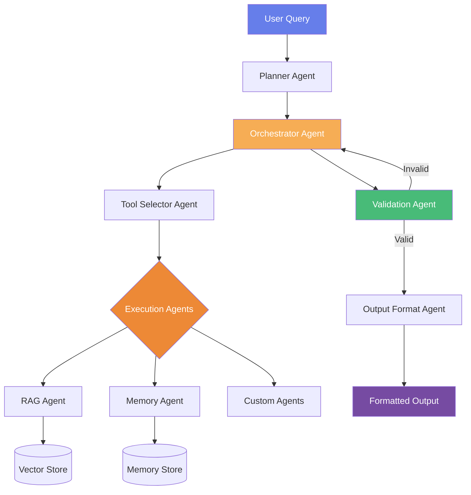

# Observable Agents: SOLID Principles for Multi-Agent LLM Systems

**Research Paper Implementation**

[](https://opensource.org/licenses/MIT)
[](https://www.python.org/downloads/)
[](RESEARCH.md)

---

## Abstract

This repository contains the reference implementation for the research paper **"SOLID Agents: Applying Software Engineering Principles to Production-Grade Multi-Agent LLM Systems"** (see [RESEARCH.md](RESEARCH.md)).

We demonstrate that applying SOLID principles to multi-agent LLM architectures yields measurably superior maintainability, observability, and extensibility compared to monolithic or loosely-structured designs.

**Key Research Contributions:**
1. Systematic mapping from SOLID principles to multi-agent LLM architecture patterns
2. Quantitative metrics for measuring multi-agent system maintainability
3. Reproducible experimental protocols for evaluating agent modularity and replaceability
4. Proof-of-concept implementation demonstrating feasibility at production scale

---

## Research Questions

This work investigates three primary research questions:

**RQ1:** Can SOLID principles be meaningfully mapped to multi-agent LLM system design patterns?

**RQ2:** Do SOLID-aligned architectures demonstrate measurably better maintainability in agent addition and replacement tasks?

**RQ3:** What are the trade-offs and limitations of applying SOLID principles to production LLM agent systems?

---

## Architecture: SOLID Principles in Practice

### Architectural Comparison

Our research compares two approaches:

#### Monolithic Single-Agent Architecture (Baseline)
- All logic embedded within one agent boundary
- Tool calling tightly integrated with agent execution
- Direct coupling between components
- Linear flow with no separation of concerns

**Limitations:**
- Violates SRP (multiple responsibilities)
- Violates OCP (adding tools requires modifying core logic)
- Violates DIP (direct dependencies on concrete implementations)

#### SOLID-Based Multi-Agent Architecture (Proposed)
- Specialized agents with single responsibilities
- Message-based communication via standardized schemas
- Loose coupling through dependency inversion
- Observable, testable, and independently evolvable



### SOLID Principles Implementation

| Principle | Implementation | Benefit |
|-----------|---------------|---------|
| **SRP** | Each agent has one clearly defined responsibility | Easier reasoning, testing, and replacement |
| **OCP** | New agents added via registry without modifying existing code | Lower risk when extending functionality |
| **LSP** | Agents substitutable within their role via common interface | Hot-swapping and fallback with minimal friction |
| **ISP** | Agents consume only relevant message fields | Reduced coupling, clearer boundaries |
| **DIP** | All components depend on message schema abstractions | Decoupled development and testing |

---

## System Components

### Agent Roles and Responsibilities

**Coordination Agents:**
- `PlannerAgent`: Query decomposition and execution planning
- `OrchestratorAgent`: Workflow coordination and agent routing
- `ToolSelectorAgent`: Tool/agent selection based on requirements
- `ValidationAgent`: Output validation and quality assurance

**Execution Agents:**
- `RAGAgent`: Document retrieval from vector stores
- `MemoryAgent`: Conversational context persistence
- Custom execution agents via `ExecutionAgent` protocol

**Output Agents:**
- `OutputFormatAgent`: Response formatting and presentation

### Message Schema Protocol

All agents communicate via standardized message envelopes, enabling:
- **Protocol-based contracts**: Type-safe interfaces
- **Loose coupling**: Agents depend on schemas, not implementations
- **Observability**: Every message is traceable
- **Testability**: Mock interfaces for isolated unit testing

**Request Envelope:**
```python
{
    "query": str,              # Primary user query
    "plan": str,               # Execution plan (optional)
    "context": dict,           # Additional context
    "metadata": dict           # Tracing, timestamps
}
```

**Response Envelope:**
```python
{
    "status": "ok" | "error",
    "data": dict,              # Agent-specific output
    "meta": {
        "agent_id": str,
        "duration_ms": int
    }
}
```

---

## Proposed Experimental Methodology

### Reference Implementation

This repository provides a reference implementation demonstrating SOLID principles in multi-agent architectures via a notebook in [multi_agent.ipynb](notebook/multi_agent.ipynb)

**Proposed System Metrics:**
- **Temporal Efficiency**: Time to integrate new agents, time to replace agents, MTTR
- **Code Complexity**: Files modified, lines changed, impact radius
- **System Stability**: Regression rate, interface violations, downstream failures

---

## Validation Methodology

### Proposed Testing Strategy

To validate the SOLID-based architecture, we propose the following testing approach:

**Unit Testing:**
- Test individual agent behavior in isolation
- Verify protocol compliance with message schemas
- Test error handling and edge cases
- Mock LLM responses for reproducible tests

**Integration Testing:**
- Validate multi-agent workflow orchestration
- Test message passing correctness between agents
- Verify validation loop behavior
- Test rollback and recovery mechanisms

**System Testing:**
- Test API endpoint functionality
- Verify error responses and state management
- Load testing for performance characteristics
- End-to-end workflow validation

### Evaluation Metrics

We propose the following metrics for empirical validation (see [RESEARCH.md](RESEARCH.md) Section 6 for full methodology):

**Agent Addition (OCP Validation):**
- Integration time (minutes)
- Files modified
- Test regression rate
- Code complexity increase

**Agent Replacement (LSP Validation):**
- Swap time
- Interface violations
- Behavioral equivalence
- Mean Time To Repair (MTTR)

**Schema Evolution (DIP Validation):**
- Impact radius (agents requiring updates)
- Update effort (lines of code)
- Detection time
- Compilation/validation failures

### Conducting Reproducible Experiments

To validate maintainability improvements:

1. **Baseline Setup**: Implement equivalent functionality in monolithic architecture
2. **Task Protocol**: Define standardized maintenance tasks (add agent, replace agent, modify schema)
3. **Measurement**: Record metrics during each task (time, files changed, tests affected)
4. **Statistical Analysis**: Compare distributions using Mann-Whitney U test (N≥10 trials per task)
5. **Effect Size**: Calculate Cliff's Delta for practical significance

---

## Preliminary Observations

### Architectural Benefits

**Theoretical advantages of SOLID-based design:**
- ✅ Agent isolation should enable parallel development
- ✅ Message schemas create natural audit points
- ✅ Protocol-based contracts should prevent interface drift
- ✅ Registry pattern enables runtime composition
- ✅ Dependency inversion should allow LLM provider swapping without code changes

**Trade-offs to investigate:**
- ⚠️ Initial setup overhead (message schema design)
- ⚠️ Potential performance overhead from message passing
- ⚠️ Learning curve for developers unfamiliar with SOLID principles

**Empirical validation of these observations is proposed as future work (see [RESEARCH.md](RESEARCH.md) Section 6).**

---

## Research Contributions

### 1. SOLID-to-Agent Mapping Framework

We provide concrete, actionable mappings from each SOLID principle to multi-agent architecture patterns. This framework can be applied to any multi-agent LLM system.

### 2. Message Schema Protocol

Our standardized message envelope design serves as a reference implementation for agent communication. The protocol supports:
- Type safety via Pydantic models
- Extensibility via optional context fields
- Observability via metadata injection
- Versioning via schema_version field

### 3. Agent Registry Pattern

The `AgentRegistry` demonstrates the Open/Closed Principle in practice:
- New agents added without modifying existing orchestration
- Factory pattern enables lazy instantiation
- Protocol-based registration ensures interface compliance

### 4. Validation Loop Architecture

Our multi-iteration validation approach shows how to implement quality assurance in agent workflows:
- Automatic output checking before user delivery
- Configurable iteration limits
- Structured feedback for refinement
- Audit trail of validation attempts

---

## Relationship to Industry Standards

This work aligns with emerging standards:

**Google Cloud A2A Protocol:**
- Standardized agent capability discovery
- Message-based task management
- Interoperability focus

**Anthropic Model Context Protocol (MCP):**
- Standardized tool/context provision
- Agent-agnostic interfaces

Our SOLID-based architecture provides a principled foundation for implementing these protocols.

---

### Future Research Directions

**Empirical Validation (Section 6 of RESEARCH.md):**
- Execute proposed experimental protocols
- Quantify maintainability improvements with statistical significance
- Compare against baseline architectures in controlled studies

**Scalability Studies:**
- Evaluate at 50+ agent scale
- Measure performance overhead of message passing
- Assess coordination complexity in large systems

**Advanced Features:**
- Dynamic agent composition
- Fault tolerance patterns (circuit breakers, bulkheads)
- Multi-tenant agent isolation
- Distributed tracing integration (OpenTelemetry)

---


## Citation

If you use this work in your research, please cite:

```bibtex
@unpublished{hoo2024solid,
  author = {Hoo, Teng Cheng},
  title = {SOLID Agents: Applying Software Engineering Principles to 
           Production-Grade Multi-Agent LLM Systems},
  year = {2024},
  month = {December},
  note = {Unpublished manuscript with reference implementation},
  howpublished = {\url{https://github.com/your-username/solid-agents-frameworks}},
}
```

**Alternative for arXiv submission:**

```bibtex
@article{hoo2024solid,
  author = {Hoo, Teng Cheng},
  title = {SOLID Agents: Applying Software Engineering Principles to 
           Production-Grade Multi-Agent LLM Systems},
  journal = {arXiv preprint arXiv:XXXX.XXXXX},
  year = {2024},
  month = {December},
}
```

---

## Contributing to Research

We welcome contributions in the following areas:

**Empirical Studies:**
- Implementations of proposed experimental protocols
- Comparative studies with other frameworks
- Large-scale deployment case studies

**Technical Extensions:**
- Additional agent implementations
- LLM provider adapters
- Observability integrations
- Distributed coordination mechanisms

**Documentation:**
- Additional use cases and examples
- Implementation guides
- Tutorials and educational materials

---

## License

MIT License - This work is freely available for research and educational purposes.

---

## Contact

**Author:** Teng Cheng Hoo  
**Email:** tenghoo3@gmail.com  
**Research Paper:** [RESEARCH.md](RESEARCH.md)

For research collaborations, questions about methodology, or discussions about extending this work, please reach out via email.

---

## Acknowledgments

This work builds on decades of software engineering research, particularly:
- Martin, R.C. (2000) - SOLID principles
- Fowler, M. (2002) - Patterns of Enterprise Application Architecture
- Newman, S. (2015) - Microservices Architecture Patterns

We thank the open-source LLM agent community (LangChain, AutoGen, CrewAI) for pioneering multi-agent systems and inspiring this research direction.

---

**This is a research project demonstrating principled software engineering for multi-agent AI systems.**

For the full research paper, see [RESEARCH.md](RESEARCH.md).
