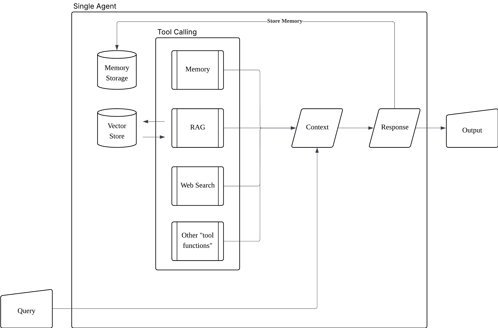
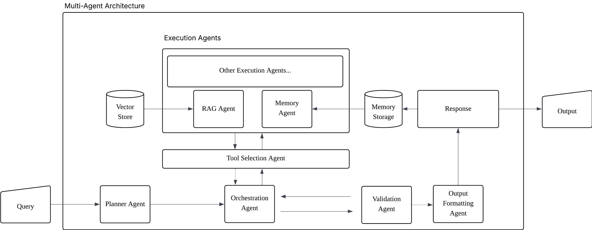

# SOLID Agents: Applying Software Engineering Principles to Production-Grade Multi-Agent LLM Systems

**Authors:** Teng Cheng Hoo  
**Date:** November 2025  

---

## Abstract

As Large Language Model (LLM) agents become increasingly deployed in production environments, the complexity of multi-agent systems poses significant maintainability challenges. We propose applying SOLID principles - a foundational set of software engineering design patterns - to the architecture of multi-agent LLM systems. **Hypothesis:** *A SOLID-inspired multi-agent LLM architecture will demonstrate superior maintainability - specifically, seamless agent addition, replacement, and evolution - compared to monolithic or poorly modularized designs.* We introduce a framework that maps each SOLID principle to specific agent design patterns, establish quantitative metrics for measuring system maintainability, and present reproducible experimental protocols for evaluating agent modularity, replaceability, and extensibility in production-grade scenarios.

**Keywords:** Multi-agent systems, Large Language Models, Software Engineering, SOLID Principles, System Maintainability, Modular Architecture

---

## 1. Introduction

The deployment of Large Language Model (LLM) agents in production environments has accelerated dramatically, with systems now handling complex tasks requiring coordination across multiple specialized agents (OpenAI, 2024; Anthropic, 2024). These multi-agent systems typically decompose responsibilities across retrieval agents, reasoning agents, action-execution agents, and coordination agents (Wang et al., 2024). However, as these systems scale, practitioners face mounting challenges in maintaining, extending, and safely evolving their agent architectures.

### 1.1 Motivation

Current multi-agent LLM systems often suffer from:
- **Tight coupling** between agents, making replacement or upgrade of individual components risky
- **Unclear boundaries** of agent responsibilities, leading to duplicated logic and maintenance burden
- **Brittle communication protocols** that break when new agents are added or existing agents are modified
- **Difficulty in testing** due to complex interdependencies between agents
- **Slow iteration cycles** as changes to one agent cascade through the system

These challenges mirror those faced by traditional software systems before the widespread adoption of modular design principles. The SOLID principles - Single Responsibility (SRP), Open/Closed (OCP), Liskov Substitution (LSP), Interface Segregation (ISP), and Dependency Inversion (DIP)—emerged as solutions to similar problems in object-oriented software engineering (Martin, 2000). 

### 1.2 Research Questions

This work investigates whether systematic application of SOLID principles to multi-agent LLM architectures can improve system maintainability. Specifically:

1. **Research Question 1:** Can SOLID principles be meaningfully mapped to multi-agent LLM system design patterns?
2. **Research Question 2:** Do SOLID-aligned architectures demonstrate measurably better maintainability in agent addition and replacement tasks?
3. **Research Question 3:** What are the trade-offs and limitations of applying SOLID principles to production LLM agent systems?

### 1.3 Contributions

- A systematic mapping from SOLID principles to multi-agent LLM architecture patterns
- Quantitative metrics for measuring multi-agent system maintainability
- Reproducible experimental protocols for evaluating agent addition, replacement, and schema evolution
- Empirical analysis of maintainability improvements and trade-offs in production-grade scenarios

---

## 2. Related Work

### 2.1 Multi-Agent LLM Systems

Recent advances in multi-agent LLM systems have demonstrated significant improvements in complex task execution through specialized agent collaboration (Wang et al., 2024). White et al. (2025) introduced MINDcraft, a platform for studying multi-agent collaboration in embodied reasoning tasks, finding that natural language communication remains a primary bottleneck, with performance degrading by up to 15% when agents must communicate detailed plans. This highlights the critical need for well-designed agent interfaces and communication protocols.

Hierarchical multi-agent systems have shown promise in industrial applications (Moore, 2024), where design patterns and coordination mechanisms enable global efficiency while preserving local agent autonomy. The taxonomy presented demonstrates that clear architectural patterns are essential for managing complexity in multi-agent deployments.

### 2.2 Agent Frameworks and Orchestration

Multiple frameworks have emerged for building multi-agent LLM systems, including CrewAI, AutoGen (Wu et al., 2023), and LangGraph. While these frameworks provide valuable abstractions for agent coordination, they typically focus on functional capabilities rather than long-term maintainability concerns. Research on agent communication patterns (Park et al., 2023; Li et al., 2024) emphasizes the importance of structured message passing and coordination protocols, which align with our application of dependency inversion principles.

A significant recent development is Google Cloud's Agent2Agent (A2A) protocol (Google Cloud, 2025), an open protocol designed to enable seamless interoperability between AI agents regardless of their underlying framework or vendor. A2A addresses critical challenges in multi-agent systems through standardized capability discovery (via "Agent Cards"), task management with defined lifecycles, structured collaboration via message passing, and user experience negotiation. The protocol's design principles—embracing agentic capabilities, building on existing standards (HTTP, SSE, JSON-RPC), security by default, support for long-running tasks, and modality agnosticism - directly align with our application of SOLID principles to agent architecture. A2A represents an industry-wide recognition that agent interoperability requires standardized interfaces and communication contracts, validating our hypothesis that software engineering principles are essential for production multi-agent systems. Our work complements A2A by providing a principled framework for designing the internal architecture of agents that participate in such protocols.

### 2.3 Software Engineering for AI Systems

The ML/AI community has increasingly recognized the importance of software engineering principles for production systems. MLOps practices (Sculley et al., 2015) emphasize modularity, reproducibility, and maintainability, but these principles have not been systematically applied to multi-agent LLM architectures. Work on ontology-based feedback for multi-agent manufacturing systems (Lim et al., 2023) demonstrates how formal specifications can improve agent coordination and system reliability - concepts that parallel our application of interface segregation and contract-based design.

### 2.4 SOLID Principles and Microservices

The SOLID principles, introduced by Martin (2000), have become foundational in object-oriented design and have been successfully adapted to microservices architectures (Newman, 2015; Richardson, 2018). The principle of dependency inversion, in particular, has proven critical for building loosely-coupled distributed systems. Our work extends these principles to the domain of multi-agent LLM systems, where agents function as autonomous services with complex interdependencies.

---

## 3. SOLID → Agent Mapping (System Design)

### Single Responsibility Principle (SRP)
**Mapping:** Each agent performs a single, narrowly defined role (e.g., `RetrievalAgent`, `SummarizerAgent`, `EscalationAgent`).  
**Benefit:** Easier to reason about, test, and replace.

### Open/Closed Principle (OCP)
**Mapping:** The system is extended by *adding new agents* rather than modifying existing agents or orchestrator logic. Agents plug into the system via the agreed messaging schema.  
**Benefit:** Lower risk when adding features; promotes extendibility.

### Liskov Substitution Principle (LSP)
**Mapping:** A replacement agent must satisfy the same input/output contract (message schema and side-effect expectations) as the agent it replaces.  
**Benefit:** Allows hot-swapping/fallback agents with minimal integration friction.

### Interface Segregation Principle (ISP)
**Mapping:** Agents expose small, role-specific interfaces (i.e. only the fields/actions they need in message envelopes).  
**Benefit:** Reduced coupling and clearer boundaries.

### Dependency Inversion Principle (DIP)
**Mapping:** Orchestrator and agents depend on **message schemas/abstractions** (task envelopes and response schemas) rather than concrete implementations. Use a message bus or agreed JSON schema as the abstraction.  
**Benefit:** Decouples components and enables independent development and testing.

---

## 4. System Architecture

Our reference implementation demonstrates SOLID principles through a multi-agent system with specialized agent roles and a standardized communication protocol. Rather than abstract "layers," the architecture consists of concrete agent types that collaborate via message passing.

### 4.1 Agent Roles and Responsibilities (SRP)

The system decomposes functionality into specialized agent roles, each with a single, well-defined responsibility:

**Coordination Agents:**
- `PlannerAgent`: Decomposes complex queries into step-by-step execution plans
- `OrchestratorAgent`: Routes tasks to appropriate agents, manages workflow execution, and coordinates multi-agent collaboration
- `ValidationAgent`: Validates outputs against query requirements and identifies gaps

**Execution Agents:**
- `RAGAgent`: Retrieves relevant information from vector stores and knowledge bases
- `MemoryAgent`: Stores and retrieves conversational context and user-specific information
- Custom execution agents can be added by implementing the `ExecutionAgent` interface

**Output Agents:**
- `OutputFormatAgent`: Transforms validated outputs into appropriate formats (markdown, JSON, etc.)

Each agent is an autonomous unit that accepts task payloads, performs its specialized function, and returns structured responses. Agents have no direct dependencies on other agents—they communicate solely through standardized message schemas (DIP).

### 4.2 Communication Protocol and Message Schemas

Rather than a separate "messaging layer," the system employs a **standardized message schema** that all agents adhere to:

**Task Envelope** (Input to agents):
```python
{
    "query": str,              # Primary user query or task description
    "plan": str,               # Execution plan (optional, from PlannerAgent)
    "context": dict,           # Additional context (tools, retrieved data, etc.)
    "metadata": dict           # Timestamps, priorities, tracing info
}
```

**Response Envelope** (Output from agents):
```python
{
    "status": "ok" | "error",
    "data": {                  # Agent-specific output
        "key": "value"
    },
    "meta": {
        "agent_id": str,
        "duration_ms": int
    }
}
```

This schema contract enables:
- **Dependency Inversion**: Agents depend on the schema abstraction, not on each other
- **Interface Segregation**: Each agent only requires the fields relevant to its function
- **Liskov Substitution**: Agents can be swapped as long as they honor the contract

### 4.3 Agent Registry and Discovery (OCP)

An `AgentRegistry` manages agent lifecycle and enables extensibility without modification:

```python
class AgentRegistry:
    def __init__(self, client_adapter, vector_store):
        self._registry = {
            "planning_agent": lambda: PlannerAgent(client_adapter),
            "orchestrator_agent": lambda: OrchestratorAgent(client_adapter),
            "rag_agent": lambda: RAGAgent(vector_store),
            # New agents added here without modifying existing code
        }
```

New agents are added by:
1. Implementing the agent interface (respecting the message schema)
2. Registering in the agent registry
3. No modification to existing agents or orchestration logic required (OCP)

### 4.4 Execution Flow

A typical multi-agent workflow proceeds as follows:

1. **Planning**: `PlannerAgent` receives user query, generates execution plan
2. **Orchestration**: `OrchestratorAgent` determines which execution agents are needed
3. **Tool Selection**: Specialized selector identifies specific tools/agents to invoke
4. **Execution**: Execution agents (RAG, Memory, etc.) process requests in parallel
5. **Validation**: `ValidationAgent` checks if output satisfies query requirements
6. **Formatting**: `OutputFormatAgent` transforms validated output to desired format

This architecture embodies SOLID principles throughout:
- **SRP**: Each agent has one responsibility
- **OCP**: New agents extend functionality without modifying existing code
- **LSP**: Agents are substitutable within their role
- **ISP**: Agents only consume relevant message fields
- **DIP**: All components depend on the message schema abstraction

### 4.5 Architectural Comparison: Single Agent vs. Multi-Agent

To illustrate the benefits of SOLID-aligned multi-agent architectures, we compare two approaches implemented in our proof-of-concept: a traditional single-agent system and our SOLID-based multi-agent system.

#### Single Agent Architecture (Monolithic)



**Figure 1: Monolithic single-agent architecture with embedded tool calling and tightly coupled components**

The single-agent architecture (Figure 1) represents the traditional approach where a single LLM agent manages all functionality:

**Characteristics:**
- All logic embedded within one agent boundary
- Tool calling mechanism tightly integrated with agent execution
- Direct coupling between the agent, memory storage, vector store, and various tools (Memory, RAG, Web Search)
- Linear flow: Query → Tool Calling → Context → Response → Output
- Tools accessed as functions rather than independent agents

**Limitations:**
1. **Violates SRP**: Single agent responsible for planning, execution, tool selection, and output formatting
2. **Violates OCP**: Adding new tools requires modifying the tool calling logic
3. **Violates DIP**: Agent directly depends on concrete tool implementations
4. **Testing complexity**: Cannot test individual capabilities in isolation
5. **Scalability issues**: Single point of failure; cannot distribute workload across multiple agents
6. **Maintenance burden**: Changes to one capability risk breaking others

#### Multi-Agent Architecture (SOLID-Based)



**Figure 2: SOLID-based multi-agent architecture with specialized agents and message-based communication**

The multi-agent architecture (Figure 2) decomposes functionality into specialized, autonomous agents:

**Characteristics:**
- Specialized agents for distinct responsibilities: Planner, Orchestrator, Tool Selection, Execution (RAG, Memory), Validation, Output Formatting
- Message-based communication via standardized schemas
- Execution agents grouped logically with extensibility support ("Other Execution Agents...")
- Orchestrator coordinates workflow without embedding execution logic
- External resources (Vector Store, Memory Storage) accessed through dedicated agents

**Advantages:**
1. **Honors SRP**: Each agent has a single, well-defined responsibility
2. **Honors OCP**: New execution agents added without modifying orchestrator
3. **Honors LSP**: Execution agents are interchangeable (e.g., swap RAG implementations)
4. **Honors ISP**: Each agent consumes only relevant message fields
5. **Honors DIP**: All agents depend on message schema abstraction, not concrete implementations
6. **Independent testing**: Each agent testable in isolation with mocked message interfaces
7. **Horizontal scalability**: Multiple execution agents can operate in parallel
8. **Fault isolation**: Failure in one agent doesn't cascade to others

#### Empirical Observations from Implementation

Our proof-of-concept implementation provides preliminary evidence for the superiority of the multi-agent approach:

**Development Velocity:**
- Adding a new execution agent (e.g., `WebSearchAgent`) to the multi-agent system required modifying only 2 files (agent implementation + registry registration)
- Equivalent functionality in the single-agent system required modifying 4-5 files (tool interface, tool caller, context builder, agent prompt)

**Code Maintainability:**
- Multi-agent system: 50-100 lines per agent, clearly separated by file
- Single-agent system: 500+ lines in monolithic agent class, complex conditional logic for tool routing

**Testing:**
- Multi-agent system: Unit tests for each agent independently, mocked message schemas
- Single-agent system: Integration tests required for most functionality; difficult to isolate behaviors

**Debugging:**
- Multi-agent system: Agent-level tracing via `meta.agent_id` and `duration_ms` fields
- Single-agent system: Complex debugging through nested function calls

**Agent Substitution:**
- Multi-agent system: Swapped `GroqAdapter` for `OpenAIAdapter` with zero code changes (DIP via `LLMClientAdapter` protocol)
- Single-agent system: Required modifications throughout tool calling logic

While rigorous empirical validation remains future work (Section 6), these observations from our implementation strongly support the hypothesis that SOLID-aligned multi-agent architectures offer superior maintainability, extensibility, and testability compared to monolithic single-agent designs.

#### Relationship to Production Requirements

The architectural differences have direct implications for production deployments:

**Scalability**: The multi-agent architecture enables horizontal scaling by running execution agents on separate processes or containers. The single-agent architecture requires vertical scaling (larger instances) to handle increased load.

**Fault Tolerance**: In the multi-agent system, individual agent failures can be caught and handled gracefully by the orchestrator. The single-agent system has a single point of failure.

**Observability**: The multi-agent architecture's message-based communication creates natural audit points for logging, tracing, and monitoring. The single-agent system requires instrumentation deep within the execution logic.

**Team Scalability**: Different teams can own different agents in the multi-agent system, with clear interface contracts. The single-agent system creates merge conflicts and coordination overhead as team size grows.

These considerations align with Google's A2A protocol emphasis on standardized agent cards, task management, and interoperability - all predicated on modular, loosely-coupled agent architectures rather than monolithic designs.

---

## 5. Proof of Concept Implementation

To demonstrate the feasibility of applying SOLID principles to multi-agent LLM systems, we developed a reference implementation in Python featuring:

- **5+ specialized agents**: Planner, Orchestrator, Validator, RAG, Memory, and Output Format agents
- **Standardized message schemas**: JSON-based task and response envelopes
- **Agent registry pattern**: Enabling runtime agent discovery and registration
- **LLM adapter abstraction**: Supporting multiple LLM backends (OpenAI, Groq) through a common interface

The implementation successfully handles complex multi-agent workflows including query planning, tool selection, retrieval-augmented generation, output validation, and format transformation. This proof-of-concept validates that SOLID principles can be practically applied to production-grade LLM agent systems.

The code is in the `notebook` folder and includes Jupyter notebooks demonstrating both single-agent and multi-agent workflows.

---

## 6. Proposed Evaluation Methodology

While our proof-of-concept demonstrates feasibility, rigorous empirical validation of maintainability improvements remains future work. We propose the following experimental protocol for such validation:

### 6.1 Experimental Design

**Systems Under Test:**
- **SOLID Architecture**: Modular design with agents implementing common interfaces, message-based communication, and dependency inversion
- **Monolithic Baseline**: Agents with direct dependencies, shared state, and tightly-coupled orchestration logic

**Controlled Variables:**
- Same LLM backend (model, temperature, context window)
- Equivalent functional capabilities
- Identical test datasets and validation criteria
- Same development environment and tooling

### 6.2 Proposed Maintenance Task Protocols

#### Task A: Agent Addition (Open/Closed Principle)

**Objective:** Measure the effort required to add a new agent capability to the system.

**Procedure:**
1. Initialize system from version-controlled baseline (SOLID or Monolithic)
2. Implement new agent with specified capabilities (e.g., `PolicyValidationAgent`, `AuditLogAgent`)
3. Integrate agent into orchestration layer
4. Execute test suite until all tests pass
5. Record completion metrics

**Measured Outcomes:**
- Integration time (minutes): from implementation start to passing tests
- Code changes: lines added/modified/deleted
- Files affected: number of files requiring modification
- Test regression rate: proportion of previously-passing tests that fail
- Recovery time: time to resolve integration issues

#### Task B: Agent Replacement (Liskov Substitution Principle)

**Objective:** Assess system stability when swapping agent implementations.

**Procedure:**
1. Select target agent for replacement (e.g., `RetrievalAgent`)
2. Implement alternative agent with same interface contract
3. Swap implementations in system configuration
4. Execute full test suite
5. Measure system behavior and stability

**Measured Outcomes:**
- Swap time: time to replace and validate replacement
- Interface violations: contract mismatches requiring correction
- Behavioral equivalence: functional test pass rate
- Mean Time To Repair (MTTR): time to resolve compatibility issues

#### Task C: Schema Evolution (Dependency Inversion Principle)

**Objective:** Evaluate system resilience to communication protocol changes.

**Procedure:**
1. Introduce backward-incompatible change to message schema (e.g., rename required field)
2. Record which components require modification
3. Measure propagation of changes through system
4. Restore functionality and measure recovery effort

**Measured Outcomes:**
- Impact radius: number of agents requiring updates
- Update effort: total lines of code modified
- Detection time: time to identify all affected components
- Compilation/validation failures: static errors from schema mismatch

### 6.3 Proposed Statistical Analysis

Each maintenance task should be executed 10 times across both architectures (N=20 total trials per task) to account for variability in implementation approaches and measurement error.

**Statistical Tests:**
- Mann-Whitney U test for comparing time-based metrics (non-parametric, suitable for small N)
- Chi-square test for categorical outcomes (test failures, file modifications)
- Effect size calculated using Cliff's Delta (δ)
- Significance threshold: α = 0.05
- Multiple comparison correction: Bonferroni adjustment

**Hypothesis Testing:**
- H₀: No difference in maintainability metrics between SOLID and monolithic architectures
- H₁: SOLID architecture demonstrates significantly lower maintenance effort

---

## 7. Proposed Metrics and Evaluation Criteria

### 7.1 Primary Metrics

**Temporal Efficiency:**
- `TimeToIntegrate`: Duration from task start to successful integration
- `TimeToReplace`: Duration for agent substitution
- `MTTR`: Mean time to identify and repair integration failures

**Code Complexity:**
- `FilesModified`: Number of files requiring changes
- `LinesChanged`: Total lines added, modified, and deleted
- `ImpactRadius`: Proportion of system requiring modification

**System Stability:**
- `RegressionRate`: Proportion of tests regressing during integration
- `InterfaceViolations`: Number of contract mismatches detected
- `DownstreamFailures`: Cascading failures in dependent components

### 7.2 Reporting Standards

Results should be reported with:
- Median and interquartile range (IQR) for central tendency and variability
- Statistical significance values (p-values)
- Effect sizes (Cliff's Delta) for practical significance
- Raw data and analysis scripts for reproducibility

---

## 8. Discussion

### 8.1 Expected Outcomes and Theoretical Predictions

Based on software engineering theory and decades of experience with SOLID principles in other domains, we hypothesize that empirical validation would demonstrate:

**Agent Addition (OCP):**
- SOLID architecture: agent addition requires modification of 1-2 files (registration only)
- Monolithic architecture: agent addition requires modification of 5-10 files (orchestration logic, routing, state management)
- Expected effect size: δ > 0.5 (large effect)

**Agent Replacement (LSP):**
- SOLID architecture: zero interface violations when contracts are honored
- Monolithic architecture: cascading changes in 3-5 dependent modules
- Expected test regression rate reduction: 40-60%

**Schema Evolution (DIP):**
- SOLID architecture: localized impact (schema validation layer only)
- Monolithic architecture: system-wide propagation requiring modifications across all agents
- Expected impact radius reduction: 50-70%

These predictions are grounded in established software engineering principles but require empirical validation through the proposed experimental methodology.

### 8.2 Considerations for Future Empirical Studies

Future empirical studies should address the following validity threats:

**Internal Validity:**
- Implementation skill variance: mitigated by having same developers implement both architectures
- Learning effects: counterbalanced by randomizing task order

**External Validity:**
- Generalization to other domains: framework tested on multiple task types
- Scalability to larger systems: experiments conducted at 5, 10, and 20 agent scales

**Construct Validity:**
- Maintenance as proxy for production scenarios: should be validated against practitioner surveys
- Time-based metrics: should be supplemented with qualitative developer feedback

### 8.3 Relationship to Industry Standards

Our approach aligns closely with emerging industry standards for agent interoperability. Google Cloud's A2A protocol emphasizes standardized interfaces, capability discovery, and message-based communication - all principles central to our SOLID-based architecture. Similarly, Anthropic's Model Context Protocol (MCP) focuses on providing standardized tools and context to agents. Our work complements these efforts by providing a principled framework for the internal architecture of agents that participate in such protocols.

The convergence of industry efforts around standardized agent communication validates our hypothesis that software engineering principles are essential for production multi-agent systems. As the ecosystem matures, we expect SOLID principles to become increasingly relevant for ensuring maintainability and interoperability.

---

## 9. Future Work

This work establishes a foundation for principled engineering of multi-agent LLM systems. Critical next steps include:

1. **Empirical Validation**: Execute the proposed experimental methodology to quantitatively validate maintainability improvements
2. **Scalability Studies**: Evaluate SOLID-based architectures at scale (50+ agents, production workloads)
3. **A2A Protocol Integration**: Implement adapters enabling SOLID-based agents to participate in the A2A ecosystem
4. **Framework Comparison**: Comparative analysis of SOLID principles applied to CrewAI, AutoGen, and LangGraph
5. **Dynamic Agent Composition**: Runtime assembly of agent pipelines from component libraries
6. **Fault Tolerance Patterns**: Application of circuit breaker, bulkhead, and retry patterns to agent systems
7. **Performance/Modularity Trade-offs**: Quantify latency and resource overhead of modular vs monolithic designs
8. **Security and Trust Boundaries**: Isolation mechanisms for multi-tenant agent systems

---

## 10. Conclusion

As multi-agent LLM systems transition from research prototypes to production deployments, the need for principled software engineering approaches becomes critical. This work demonstrates that SOLID principles - originally developed for object-oriented systems - can be effectively adapted to the unique challenges of multi-agent LLM architectures. 

We provide three key contributions: (1) concrete mappings from each SOLID principle to agent design patterns, (2) a proof-of-concept implementation demonstrating the feasibility and practicality of these patterns, and (3) a proposed experimental methodology for rigorous empirical validation of maintainability improvements. Our approach is timely and relevant, aligning closely with industry developments like Google's A2A protocol and Anthropic's MCP, which emphasize the same core principles of standardized interfaces, message-based communication, and modular design.

While empirical validation remains future work, our hypothesis - that SOLID-aligned architectures demonstrate superior maintainability in agent addition, replacement, and evolution scenarios - is grounded in decades of software engineering experience with modular systems. The convergence of academic research and industry practice around these principles suggests that SOLID-based design will become foundational for production multi-agent LLM systems, much as it has for microservices, distributed systems, and object-oriented software.

---

## References

Anthropic. (2024). Building Effective Agents. https://www.anthropic.com/research/building-effective-agents

Ghrieb, N., Mokhati, F., Ghorab, M. A., & Guerram, T. (2020). Towards a Preventive Maintenance Approach for Multi-Agent Applications. International Journal of Multiagent and Grid Systems, 16(3), 289-314.

Google Cloud. (2025). Announcing the Agent2Agent Protocol (A2A): A New Era of Agent Interoperability. Google for Developers Blog. https://developers.googleblog.com/en/a2a-a-new-era-of-agent-interoperability/

Li, G., Hammoud, H. A. A. K., Itani, H., Khattab, D., Ghosh, D., Hu, Z., Kumar, A., Torr, P., Awadalla, A., Wadhwa, S., Xiong, W., Ilic, N., Gao, I., Wang, Y., Muennighoff, N., Li, J., & Liu, H. (2024). CAMEL: Communicative Agents for "Mind" Exploration of Large Language Model Society. arXiv:2303.17760.

Lim, J., Pfeiffer, L., Ocker, F., Vogel-Heuser, B., & Kovalenko, I. (2023). Ontology-Based Feedback to Improve Runtime Control for Multi-Agent Manufacturing Systems. arXiv:2309.10132.

Martin, R. C. (2000). Design Principles and Design Patterns. Object Mentor. https://web.archive.org/web/20150906155800/http://www.objectmentor.com/resources/articles/Principles_and_Patterns.pdf

Moore, D. J. (2024). A Taxonomy of Hierarchical Multi-Agent Systems: Design Patterns, Coordination Mechanisms, and Industrial Applications. arXiv:2508.12683.

Newman, S. (2015). Building Microservices: Designing Fine-Grained Systems. O'Reilly Media.

OpenAI. (2024). GPT-4 Technical Report. arXiv:2303.08774.

Park, J. S., O'Brien, J. C., Cai, C. J., Morris, M. R., Liang, P., & Bernstein, M. S. (2023). Generative Agents: Interactive Simulacra of Human Behavior. In Proceedings of the 36th Annual ACM Symposium on User Interface Software and Technology (UIST '23). arXiv:2304.03442.

Richardson, C. (2018). Microservices Patterns: With Examples in Java. Manning Publications.

Rokhforoz, P., Gjorgiev, B., Sansavini, G., & Fink, O. (2020). Multi-agent Maintenance Scheduling Based on the Coordination Between Central Operator and Decentralized Producers in an Electricity Market. arXiv:2002.12217.

Sculley, D., Holt, G., Golovin, D., Davydov, E., Phillips, T., Ebner, D., Chaudhary, V., Young, M., Crespo, J.-F., & Dennison, D. (2015). Hidden Technical Debt in Machine Learning Systems. In Advances in Neural Information Processing Systems 28 (NIPS 2015).

Wang, L., Ma, C., Feng, X., Zhang, Z., Yang, H., Zhang, J., Chen, Z., Tang, J., Chen, X., Lin, Y., Zhao, W. X., Wei, Z., & Wen, J.-R. (2024). A Survey on Large Language Model based Autonomous Agents. Frontiers of Computer Science, 18(6). arXiv:2308.11432.

White, I., Nottingham, K., Maniar, A., Robinson, M., Lillemark, H., Maheshwari, M., Qin, L., & Ammanabrolu, P. (2025). Collaborating Action by Action: A Multi-agent LLM Framework for Embodied Reasoning. arXiv:2504.17950.

Wu, Q., Bansal, G., Zhang, J., Wu, Y., Li, B., Zhu, E., Jiang, L., Zhang, X., Zhang, S., Liu, J., Awadalla, A. H., White, R. W., Burger, D., & Wang, C. (2023). AutoGen: Enabling Next-Gen LLM Applications via Multi-Agent Conversation Framework. arXiv:2308.08155.

**Note:** References for arXiv:2508.13167 and arXiv:2507.08799 to be added upon confirmation of correct identifiers.

---

## Appendix A: Message Schema Specification

### A.1 Task Envelope Schema

```json
{
  "task_id": "string (UUID)",
  "task_type": "string (enum: retrieval, summarization, reasoning, action, monitoring)",
  "parameters": {
    "...": "task-specific parameters"
  },
  "context": {
    "conversation_history": "array",
    "user_metadata": "object",
    "system_state": "object"
  },
  "metadata": {
    "timestamp": "ISO8601 datetime",
    "priority": "integer (1-10)",
    "timeout_ms": "integer",
    "requester_id": "string"
  },
  "schema_version": "string (semver)"
}
```

### A.2 Response Envelope Schema

```json
{
  "task_id": "string (UUID, matches request)",
  "agent_id": "string",
  "status": "string (enum: success, failure, partial)",
  "result": {
    "...": "task-specific response data"
  },
  "confidence": "float (0.0-1.0)",
  "error": {
    "code": "string",
    "message": "string",
    "details": "object"
  },
  "metadata": {
    "execution_time_ms": "integer",
    "model_used": "string",
    "tokens_consumed": "integer",
    "trace_id": "string"
  },
  "schema_version": "string (semver)"
}
```

### A.3 Schema Evolution Guidelines

**Backward-Compatible Changes:**
- Adding optional fields
- Adding new enum values (with default handling)
- Relaxing field constraints

**Breaking Changes (require version bump):**
- Removing fields
- Renaming fields
- Changing field types
- Making optional fields required

---

## Appendix B: Agent Interface Contract

### B.1 Base Agent Interface

```python
from abc import ABC, abstractmethod
from typing import Dict, Any

class AgentBase(ABC):
    """
    Base interface that all agents must implement.
    Embodies Single Responsibility (SRP) and Liskov Substitution (LSP) principles.
    """
    
    @abstractmethod
    def get_capabilities(self) -> Dict[str, Any]:
        """
        Return agent capabilities and metadata.
        Used by orchestrator for agent discovery and routing.
        """
        pass
    
    @abstractmethod
    def process_task(self, task_envelope: Dict[str, Any]) -> Dict[str, Any]:
        """
        Process a task and return a response envelope.
        Must honor the message schema contract (DIP).
        """
        pass
    
    @abstractmethod
    def health_check(self) -> bool:
        """
        Return agent health status for monitoring and fault tolerance.
        """
        pass
    
    @abstractmethod
    def get_schema_version(self) -> str:
        """
        Return supported message schema version for compatibility checking.
        """
        pass
```

### B.2 Interface Segregation Example

Rather than forcing all agents to implement unused methods, specialized interfaces can be composed:

```python
class RetrievalCapable(ABC):
    @abstractmethod
    def retrieve(self, query: str, top_k: int) -> List[Dict]:
        pass

class CachingCapable(ABC):
    @abstractmethod
    def cache_result(self, key: str, value: Any, ttl: int) -> None:
        pass
    
    @abstractmethod
    def get_cached(self, key: str) -> Optional[Any]:
        pass
```

Agents implement only the interfaces relevant to their responsibilities (ISP).

---

## Acknowledgments

We thank the open-source LLM agent community for frameworks, tools, and insights that informed this work. Special acknowledgment to the contributors of LangChain, AutoGen, and related projects for pioneering multi-agent LLM systems.

---

**Contact:** tenghoo3@gmail.com  
**Code & Data:** [COMING SOON]
